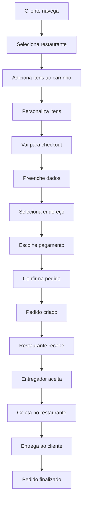

# 📊 Análise Completa do Sistema AmaDelivery

**Data da Análise:** 2024-12-19  
**Status:** ✅ Concluído  
**Objetivo:** Análise detalhada para implementação de melhorias  

---

## 🎯 **Visão Geral do Sistema**

O **AmaDelivery** é um sistema completo de delivery de comida com arquitetura moderna, incluindo:

- **Frontend**: React 18 + Vite + TypeScript
- **Backend**: Node.js + Express + TypeScript  
- **Banco de Dados**: PostgreSQL com Prisma ORM
- **Autenticação**: JWT com refresh tokens
- **UI/UX**: Tailwind CSS + shadcn/ui
- **Estado**: React Query + Context API

---

## 🏗️ **Arquitetura do Sistema**

### **Frontend (React + Vite)**
- **React 18** com hooks modernos
- **Vite** para build e desenvolvimento
- **React Router** para navegação
- **React Query** para cache e estado servidor
- **Tailwind CSS** para estilização
- **shadcn/ui** para componentes
- **Context API** para autenticação

### **Backend (Node.js + TypeScript)**
- **Express.js** como framework web
- **Prisma** como ORM para PostgreSQL
- **JWT** para autenticação
- **Zod** para validação de schemas
- **bcrypt** para hash de senhas
- **Helmet, CORS, Rate Limiting** para segurança

### **Banco de Dados (PostgreSQL)**
- **Prisma ORM** com schema tipado
- **Migrações** automáticas
- **Seed** para dados iniciais

---

## 🔧 **Funcionalidades Implementadas**

### **1. Sistema de Autenticação**
- ✅ JWT com refresh tokens
- ✅ Roles: admin, restaurante, entregador, cliente
- ✅ Middleware de autenticação
- ✅ Controle de acesso por role
- ✅ Sessão persistente no localStorage

### **2. Gestão de Restaurantes**
- ✅ CRUD completo de restaurantes
- ✅ Categorias e filtros
- ✅ Cardápio com personalização
- ✅ Avaliações e ratings
- ✅ Horários e taxas de entrega

### **3. Sistema de Pedidos**
- ✅ Carrinho de compras com sessão
- ✅ Personalização de itens
- ✅ Cálculo automático de totais
- ✅ Status de pedidos (pendente → confirmado → preparando → entregue)
- ✅ Histórico de pedidos

### **4. Sistema de Pagamentos**
- ✅ Cartões salvos (últimos 4 dígitos)
- ✅ Pagamento em dinheiro
- ✅ Cálculo de troco
- ⚠️ Stripe (documentado mas não implementado)

### **5. Sistema de Entregadores**
- ✅ Cadastro e aprovação
- ✅ Painel com mapa
- ✅ Notificações de pedidos
- ✅ Status de entrega (aceito → coletado → entregue)
- ✅ Cálculo de ganhos

### **6. Interface do Usuário**
- ✅ Design responsivo
- ✅ Componentes reutilizáveis
- ✅ Loading states e feedback
- ✅ Modais e sheets

---

## 🔄 **Fluxo de Pedidos**



---

## 📊 **Pontos Fortes do Sistema**

### **1. Arquitetura Sólida**
- Separação clara entre frontend e backend
- Código bem estruturado e organizado
- Padrões modernos de desenvolvimento

### **2. Segurança**
- Autenticação JWT robusta
- Validação de dados com Zod
- Sanitização de entrada
- Rate limiting e CORS

### **3. Experiência do Usuário**
- Interface intuitiva e responsiva
- Feedback visual adequado
- Componentes reutilizáveis

### **4. Manutenibilidade**
- Código bem documentado
- Estrutura modular
- TypeScript para tipagem

### **5. Performance**
- React Query para cache
- Lazy loading de componentes
- Otimizações de bundle

---

## 🚀 **Oportunidades de Melhoria**

### **1. Performance**
- [ ] Lazy loading de imagens
- [ ] Code splitting mais agressivo
- [ ] Otimização de queries
- [ ] Cache de API mais inteligente

### **2. Funcionalidades**
- [ ] Notificações push
- [ ] Chat em tempo real
- [ ] Geolocalização em tempo real
- [ ] Sistema de cupons
- [ ] Avaliações de pedidos

### **3. Integrações**
- [ ] Stripe para pagamentos
- [ ] SMS/WhatsApp para notificações
- [ ] Google Maps para entregas
- [ ] Analytics e métricas

### **4. Mobile**
- [ ] PWA (Progressive Web App)
- [ ] App nativo
- [ ] Funcionalidades offline

---

## 📋 **Recomendações de Implementação**

### **Curto Prazo (1-2 meses)**
1. **Implementar Stripe** para pagamentos seguros
2. **Notificações em tempo real** com WebSocket
3. **Geolocalização** para entregas
4. **Otimizações de performance**

### **Médio Prazo (3-6 meses)**
1. **PWA** para experiência mobile
2. **Chat** entre cliente e entregador
3. **Sistema de cupons** e promoções
4. **Analytics** e relatórios

### **Longo Prazo (6+ meses)**
1. **App nativo** (React Native)
2. **IA** para recomendações
3. **Marketplace** multi-restaurante
4. **Expansão internacional**

---

## 🗂️ **Estrutura de Arquivos**

### **Frontend**
```
src/
├── components/          # Componentes reutilizáveis
│   ├── ui/             # Componentes base (shadcn/ui)
│   ├── public/         # Componentes públicos
│   ├── restaurant/     # Componentes de restaurante
│   ├── checkout/       # Componentes de checkout
│   ├── account/        # Componentes de conta
│   └── drivers/        # Componentes de entregadores
├── pages/              # Páginas da aplicação
├── hooks/              # Custom hooks
├── contexts/           # Contextos React
├── api/                # Cliente API
└── utils/              # Utilitários
```

### **Backend**
```
server/src/
├── routes/             # Rotas da API
├── middleware/         # Middlewares
├── utils/              # Utilitários
├── schemas/            # Schemas de validação
├── services/           # Serviços de negócio
└── lib/                # Configurações
```

---

## 🗄️ **Modelos de Dados**

### **User (Usuário)**
- `id`, `email`, `fullName`, `role`, `tipoUsuario`
- `telefone`, `enderecosSalvos`, `metodosPagamento`
- `restaurantId`, `status`, `createdDate`

### **Restaurant (Restaurante)**
- `id`, `nome`, `descricao`, `categoria`
- `endereco`, `telefone`, `email`
- `tempoEntrega`, `taxaEntrega`, `pedidoMinimo`
- `rating`, `totalAvaliacoes`, `ativo`

### **MenuItem (Item do Cardápio)**
- `id`, `nome`, `descricao`, `categoria`
- `preco`, `disponivel`, `imagemUrl`
- `ingredientes`, `alergenos`, `adicionais`
- `opcoes_personalizacao`, `restaurantId`

### **Order (Pedido)**
- `id`, `numeroPedido`, `status`
- `clienteNome`, `clienteEmail`, `clienteTelefone`
- `enderecoEntrega`, `itens`, `subtotal`
- `taxaEntrega`, `taxaServico`, `desconto`, `total`
- `metodoPagamento`, `valorPago`, `troco`
- `bandeiraCartao`, `finalCartao`, `nomeTitular`
- `restaurantId`, `dataEntrega`

### **Entregador (Entregador)**
- `id`, `nomeCompleto`, `email`, `telefone`
- `cpf`, `dataNascimento`, `endereco`
- `veiculo`, `placa`, `status`
- `avaliacao`, `totalEntregas`, `userId`

### **Cart (Carrinho)**
- `id`, `sessionId`, `restaurantId`
- `itens`, `subtotal`, `createdDate`

---

## 🔐 **Sistema de Autenticação**

### **Fluxo de Login**
1. Usuário insere credenciais
2. Backend valida com bcrypt
3. Gera JWT token
4. Frontend armazena no localStorage
5. Token enviado em requisições subsequentes

### **Roles e Permissões**
- **admin**: Acesso total ao sistema
- **restaurante**: Gerencia restaurante e pedidos
- **entregador**: Painel de entregas
- **cliente**: Fazer pedidos e gerenciar conta

### **Middleware de Segurança**
- `authenticate`: Verifica token JWT
- `requireRole`: Valida permissões por role
- `rateLimit`: Previne spam de requisições
- `sanitizeInput`: Limpa dados de entrada

---

## 💳 **Sistema de Pagamentos**

### **Métodos Implementados**
1. **Cartões Salvos**: Últimos 4 dígitos + bandeira
2. **Dinheiro**: Pagamento na entrega com troco
3. **Stripe**: Documentado mas não implementado

### **Fluxo de Pagamento**
1. Cliente seleciona método
2. Validação de dados
3. Cálculo de totais e troco
4. Confirmação do pedido
5. Atualização de status

---

## 🚚 **Sistema de Entregas**

### **Status de Entrega**
- `aceito`: Entregador aceitou o pedido
- `coletado`: Pedido coletado no restaurante
- `entregue`: Pedido entregue ao cliente

### **Painel do Entregador**
- Mapa com localização em tempo real
- Notificações de novos pedidos
- Cálculo de ganhos
- Histórico de entregas

---

## 📱 **Interface e UX**

### **Design System**
- **Cores**: Laranja (#f97316) como cor principal
- **Tipografia**: Sistema de fontes responsivo
- **Componentes**: shadcn/ui para consistência
- **Layout**: Grid responsivo com Tailwind

### **Componentes Principais**
- `RestaurantCard`: Card de restaurante
- `MenuItemCard`: Item do cardápio
- `CartSidebar`: Carrinho lateral
- `PaymentMethodSelector`: Seletor de pagamento
- `AddressSelector`: Seletor de endereço

---

## 🧪 **Testes e Qualidade**

### **Ferramentas de Desenvolvimento**
- **ESLint**: Linting de código
- **Prettier**: Formatação automática
- **TypeScript**: Tipagem estática
- **React Query DevTools**: Debug de cache

### **Estrutura de Testes**
- **Jest**: Framework de testes
- **Supertest**: Testes de API
- **Testes unitários**: Componentes e funções
- **Testes de integração**: Fluxos completos

---

## 🚀 **Deploy e Produção**

### **Configuração de Produção**
- **Docker**: Containerização
- **Nginx**: Proxy reverso
- **SSL/TLS**: Certificados de segurança
- **Variáveis de ambiente**: Configuração segura

### **Monitoramento**
- **Logs estruturados**: Winston
- **Health checks**: Endpoint de status
- **Métricas**: Performance e uso
- **Alertas**: Notificações de erro

---

## 📈 **Métricas e Analytics**

### **KPIs Principais**
- Pedidos por dia/semana/mês
- Tempo médio de entrega
- Taxa de conversão
- Satisfação do cliente
- Performance dos entregadores

### **Relatórios**
- Dashboard administrativo
- Relatórios de vendas
- Análise de performance
- Métricas de entrega

---

## 🔮 **Roadmap Futuro**

### **Fase 1: Estabilização (Q1 2025)**
- [ ] Implementar Stripe
- [ ] Notificações em tempo real
- [ ] Otimizações de performance
- [ ] Testes automatizados

### **Fase 2: Expansão (Q2 2025)**
- [ ] PWA para mobile
- [ ] Sistema de cupons
- [ ] Chat em tempo real
- [ ] Geolocalização avançada

### **Fase 3: Inovação (Q3 2025)**
- [ ] App nativo
- [ ] IA para recomendações
- [ ] Marketplace multi-restaurante
- [ ] Analytics avançados

### **Fase 4: Escala (Q4 2025)**
- [ ] Expansão internacional
- [ ] Integração com outros serviços
- [ ] API pública
- [ ] White-label solution

---

## 🎯 **Conclusão**

O sistema AmaDelivery possui uma **arquitetura sólida e bem estruturada**, com funcionalidades essenciais implementadas e um código de qualidade. O sistema está pronto para implementação de melhorias e expansão de funcionalidades.

### **Próximos Passos Recomendados:**
1. **Implementar Stripe** para pagamentos seguros
2. **Adicionar notificações em tempo real** com WebSocket
3. **Otimizar performance** com lazy loading e cache
4. **Implementar PWA** para experiência mobile
5. **Adicionar sistema de cupons** e promoções

---

**📝 Notas para Implementação:**
- Manter a arquitetura atual como base
- Implementar melhorias de forma incremental
- Testar cada funcionalidade antes de deploy
- Documentar mudanças no código
- Manter compatibilidade com versões anteriores

---

*Este documento serve como base para todas as implementações futuras do sistema AmaDelivery.*
